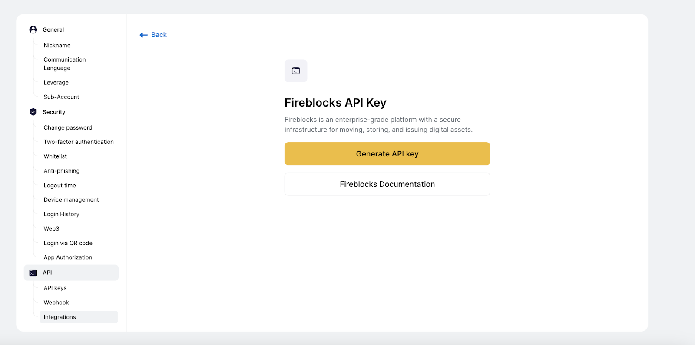
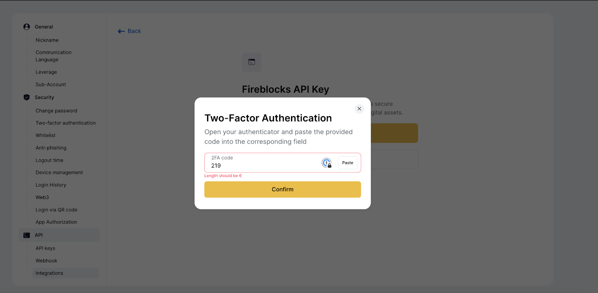
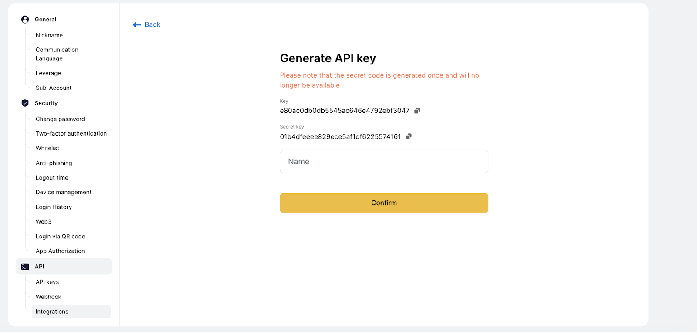
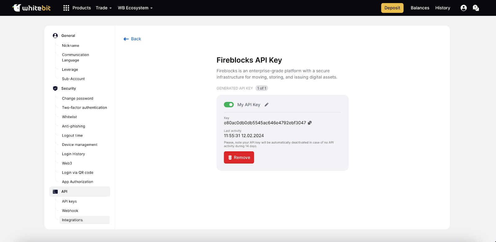

# How to Connect Fireblocks via API?

The Fireblocks Network is a secure transfer system enabling immediate discovery, connection, and transfer of digital assets among exchanges, fiat providers, liquidity partners, and counterparties.

To successfully connect your WhiteBIT account to Fireblocks, you must generate a unique API key and an API secret. These are the credentials required to use an API Hook. Please note that the standard WhiteBIT API key is unsuitable in this case.

Here's a step-by-step instruction on how to generate a Fireblocks API key:

1. **Open "API" → "Integrations."** Enter your WhiteBIT account and find the "API" page in the account settings. In the "API" section, choose "Integrations."

2. **Generate an API key.** Here, you will be able to generate an API key for Fireblocks. Press the "Generate API key" button.
3. **Confirm with 2FA code.** Please note that two-factor authentication (2FA) confirmation is required to complete the key generation process. Confirm the operation with the 2FA code from your Authenticator app.

4. **API key and API secret generation.** After successfully entering 2FA, the system will automatically generate a unique API key and API secret. Please note that the API secret will only be visible once. Hence, safely storing the generated API secret is recommended to ensure your data's security.

5. **Key title.** Name the API key you just generated.
6. **Confirm the key generation.** Confirm the completion of the key generation process by following the on-screen instructions.

> **Note:** The Fireblocks system allows you to generate a maximum of one API key for your account.

Thank you for your attention to our instructions. Your generated keys are now ready to be used to connect to Fireblocks.

---

## Configure your WhiteBIT account

To connect your WhiteBIT account to Fireblocks, generate a Fireblocks API key. See the instructions on generating your Fireblocks API key in WhiteBIT API Documentation.

1. On the "API" page, choose "Integrations" and click "Generate API Key".
2. Confirm the operation with the 2FA code from your Authenticator app.
3. The system will automatically generate an API key and an API secret. Keep track of both the API key and the API secret.
4. Give a title to the key you just generated.
5. Confirm the key generation.

> **Note:** You can generate only one key for your account.

